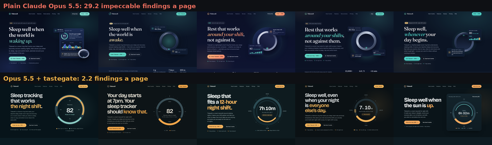

# tastegate

**Taste + impeccable in one Claude Code / Codex skill, plus a gate that checks the page in a real browser before the agent can call it done.**

Free, MIT. Part of [SWE Stack](https://skills.bles-software.com) by Bles Software.

## Measured, 30 Sept 2026

Same landing-page brief ([bench/brief.txt](bench/brief.txt)), same model (Claude Opus 5.5 in Claude Code), 5 pages per arm, every other skill disabled in both arms. The judge is **impeccable's own detector** (`impeccable detect`, v4.4.0), which tastegate never runs, so the skill cannot study for the test.



| | Plain Opus 5.5 | Opus 5.5 + tastegate |
|---|---|---|
| impeccable detector findings per page | **29.2** (30, 24, 37, 23, 32) | **2.2** (1, 2, 1, 1, 6) |
| tastegate gate fails per page | 45.4 | 0 |
| pages with 3 same-size icon cards in a row | 5 of 5 | 0 of 5 |
| pages with eyebrow labels over headings | 5 of 5 | 0 of 5 |
| pages with em dashes in the copy | 5 of 5 | 0 of 5 |
| minutes per page | 2.9 | 4.0 |
| cost per page (API list price) | $0.65 | $0.89 |

13x fewer findings from the other skill's own detector, for about a minute and 24 cents more per page. Every number, the prompts and the scorer are in [bench/](bench/): `bench/run_one.sh plain 1`, then `python3 bench/score.py`.

## What it is

Two of the best open design skills, cut down and merged, plus the missing piece:

| Step | From | What it does |
|---|---|---|
| 1. Read the room | [taste-skill](https://github.com/Leonxlnx/taste-skill) (MIT) | One-line design read, three dials (variance, motion, density), type and palette direction, a signature detail. Stops the default look before it is written. |
| 2. Craft floor | [impeccable](https://github.com/pbakaus/impeccable) (Apache-2.0) | Contrast, spacing, type measure, states, browser surfaces, and the refuse list: eyebrows, three equal cards, gradient text, AI purple, emoji icons. |
| 3. The gate | ours | `scripts/gate.py` renders the page in headless Chromium at 390px and 1440px and fails on 17 rules the model cannot see in its own CSS. |
| 4. Look | ours | The agent opens both screenshots after the last change, then stops. |

The two source skills are excellent at telling the model what good looks like. A model still cannot see that its hero overlaps the nav at 390px, or that its gray caption is 2.1:1 on the card it sits on. The browser can, so the gate asks the browser.

## Install

Claude Code:

```bash
git clone https://github.com/stas4000/tastegate
cp -r tastegate/tastegate ~/.claude/skills/        # or .claude/skills/ in one project
pip install playwright && python3 -m playwright install chromium
```

Codex: copy the same folder to `~/.codex/skills/tastegate`.

Then ask for any UI work as usual ("build the landing page", "make this dashboard look better"), or name it: "use tastegate".

## The gate on its own

```bash
python3 tastegate/scripts/gate.py site/index.html        # or http://localhost:3000
```

```
FAIL  equal_icon_cards  [desktop]  x3
      div.steps "01 Add your roster Import your schedule or tap i": 3 same-size icon + heading + text cards in a row
FAIL  eyebrow_labels  [desktop]  x1
      span.eyebrow "HOW IT WORKS": 6 small uppercase labels over headings, at most 3 for 7 sections
FAIL  low_contrast  [mobile]  x9
      span.avatar "MR": 1.23:1, needs 4.5:1 at 13.44px
FAIL  small_tap_target  [mobile]  x12
      a "How it works": 92x19px link, needs 24px
tastegate FAIL: 45 fail, 0 warn. Screenshots: .tastegate/mobile.png, .tastegate/desktop.png
```

That is a real plain Opus 5.5 page from the bench. The avatar initials were meant to be white; a `.who span` rule turned them gray on teal, 1.23:1. The model never saw it. The browser did.

Exit 0 means no fail findings, 1 means fix something, 2 means the page did not render.

| Rule | Checked on | Fails when |
|---|---|---|
| `sideways_scroll` | both | the page is wider than the screen |
| `text_overlap` | both | two runs of visible text overlap on screen |
| `low_contrast` | both | text is under 4.5:1 (3:1 for large) against its real background |
| `tiny_text` | phone | visible text under 12px |
| `small_tap_target` | phone | a control under 40px or a standalone link under 24px |
| `no_viewport_meta` | phone | no viewport meta tag |
| `hero_below_fold` | desktop | the H1 ends below the first screen |
| `broken_image`, `image_without_alt` | both | an image failed to load or has no alt |
| `ai_purple_gradient` | desktop | a violet or indigo gradient |
| `gradient_text` | desktop | text filled with a gradient |
| `emoji_icon` | desktop | emoji or pictographs used as icons |
| `eyebrow_labels` | desktop | more than one small uppercase label per three sections |
| `equal_icon_cards` | desktop | three or more same-size icon + heading + text cards in a row |
| `default_display_font` | desktop | headings set in Inter, Roboto, Arial, Helvetica or the system stack |
| `placeholder_copy` | desktop | lorem ipsum, Acme, John Doe, example.com |
| `em_dash` | desktop | em dashes in the copy |

Warnings (colored glow shadows, 40-43px controls, a display font that did not load, no CTA in the first screen) are printed but never fail the run.

Tests: `python3 -m pytest tests -q` builds a clean page and one page per rule with exactly that defect injected.

## Credits

tastegate would not exist without [impeccable](https://github.com/pbakaus/impeccable) by Paul Bakaus and [taste-skill](https://github.com/Leonxlnx/taste-skill) by Leonxlnx. What we took, from which commit, and what we changed is in [tastegate/THIRD_PARTY_NOTICES.md](tastegate/THIRD_PARTY_NOTICES.md). Not affiliated with either project.

## More skills

tastegate is free. [SWE Stack](https://skills.bles-software.com) is 23 more skills that make coding agents prove their work before they say done, including the visual QA scanner this gate grew from. Built by [Bles Software](https://bles-software.com).
